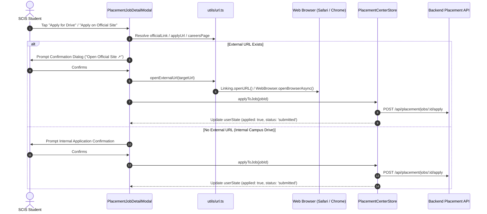

# Placement Center - Official Site Application Integration Documentation

## Overview
In the **SCIS Connect Mobile** Placement Center, recruitment drives and job postings often require students to apply directly through the hiring company's official portal (e.g. Keka, Greenhouse, Lever, Workday, or custom company career portals).

This implementation enables seamless redirection to the official application site (`officialLink`, `careersPage`, `applyUrl`) upon clicking **Apply for Drive** (or tapping dedicated portal buttons), while concurrently registering the student's application status with the SCIS Placement Center backend API (`/api/placement/jobs/:id/apply`).

---

## Technical Architecture & Flow



---

## Data Model Extensions (`features/placement/types.ts`)

```typescript
export interface PlacementJob {
  _id: string;
  title: string;
  companyName: string;
  companyLogo?: string;
  jobType: "job" | "internship" | string;
  package?: number;
  stipend?: number;
  applicationDeadline?: string;
  
  // Official Application & Careers Metadata
  officialLink?: string;        // e.g. "https://amura.keka.com/careers/applyjob/134281"
  careersPage?: string;         // e.g. "https://amura.keka.com/careers"
  applyUrl?: string;            // Standard / legacy external apply link
  externalApplyUrl?: string;    // Fallback external application link
  referralAvailable?: boolean;  // Student peer / alumni referral available
  hiddenFromUsers?: boolean;    // Admin visibility toggle

  userState?: {
    applied: boolean;
    applicationStatus: string | null;
    saved: boolean;
    reminder: boolean;
  };
}
```

---

## URL Resolution Priority

When resolving where to redirect the student:
1. `job.officialLink` (Highest priority: direct application form)
2. `job.applyUrl`
3. `job.externalApplyUrl`
4. `job.careersPage`
5. `job.company.careersUrl`
6. `job.company.website`

---

## UI Components Updated

1. **`PlacementJobDetailModal.tsx`**:
   - Dynamic CTA Button: Displays `"Apply on Official Site ↗"` when an official link is detected.
   - Dedicated Portal Cards: Renders interactive `"Official Application Portal"` and `"Company Careers Site"` quick action cards.
   - Badges: Renders `"🤝 Referral Available"` and `"🌐 Official Portal"` pill badges.
   - Dual Action: Launches the official portal and registers the application with placement cell in one tap.

2. **`PlacementJobCard.tsx`**:
   - Renders `"🤝 Referral"` badge when `referralAvailable === true`.
   - Renders `"↗ Official"` indicator for external postings.

3. **`PlacementDetailModal.tsx`**:
   - Updated drive application action in Placement Studio to support opening official drive application links.

4. **`features/placement/store.ts`**:
   - Filters out postings where `hiddenFromUsers === true` from student feeds.

5. **`utils/url.ts`**:
   - `formatExternalUrl`: Sanitizes URLs and guarantees `https://` prefix.
   - `openExternalUrl`: Universal cross-platform external browser launcher with graceful fallback.
